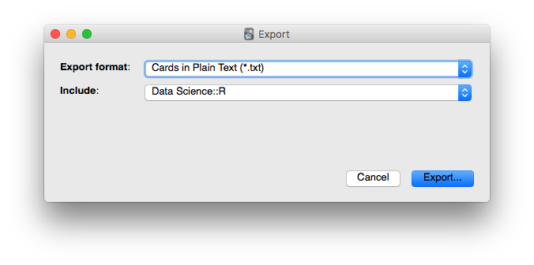
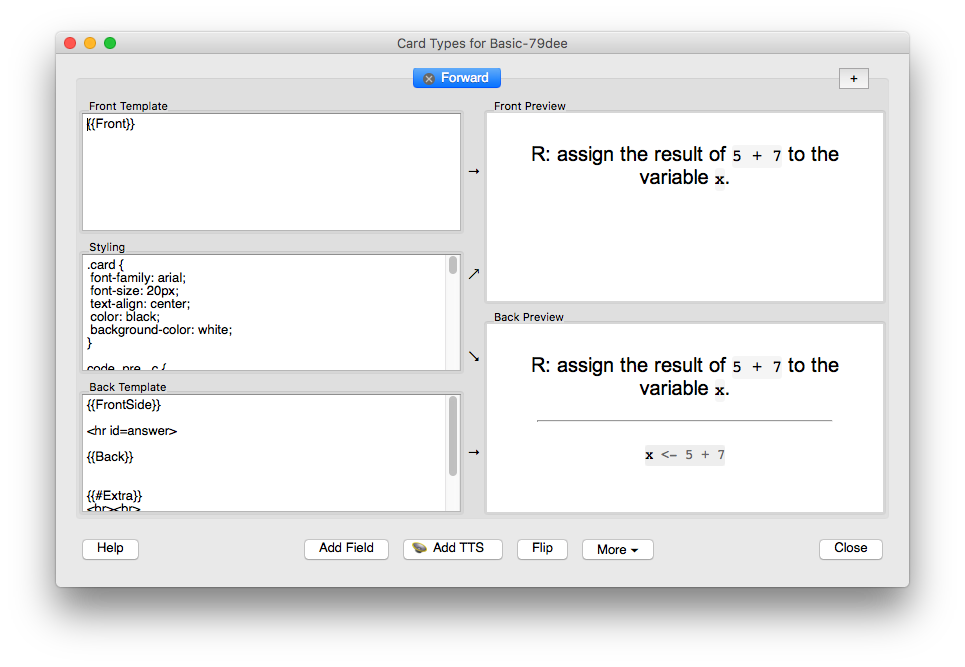

```{r global_options, include=FALSE}
rm(list=ls()) ### To clear namespace
library(knitr)
# knitrengines to render HTML more nicely
# To install:
# devtools::install_github("hrbrmstr/knitrengines")
library(knitrengines)
opts_chunk$set(fig.width=12, fig.height=8, fig.path='Figs/',
               echo=TRUE, warning=FALSE, message=FALSE)
```

To incorporate Anki cards in a flipped classroom-based teaching approach, I'd like to be able to present the content of Anki cards I've prepared for the class as a PowerPoint-like presentation. 

Second, I'd like to be able to create a print-out that *only shows the question part* of the flashcard. Print-outs will be used as problem sets in class.

The purpose of this literate program is to convert exported Anki cards to a [Slidy](https://www.w3.org/Talks/Tools/Slidy2/#(1)) presentation. I will add some CSS to hide the answers on printed-out slides.

## Analysis of the problem

Anki exports cards in the form of tab-separated value (TSV) files when the **Cards in Plain text (\*.txt)** is selected as the **Export format**:



The data structure of the TSV is:

- One line per card.
- Two fields per line (front and back), delimited by a single `\t`
- No header line.
- The fields contain text in HTML.

Here is an example line:

```{pygments, pyg.ext="html", pyg.sty="github"}
R: define <b>vector</b>.\tA <b>sequence of data elements</b> of the same <b>data type</b>
```

Here is a more complex example:

```{pygments, pyg.ext="html", pyg.sty="github"}
"R: are the two variable names <code class=""myCodeClass"">my_sqrt</code> and <code class=""myCodeClass""> My_sqrt</code> equivalent?"\t"<b>No</b><br><br> <div class=""extra"">Variable names in R are <b>case sensitive</b>.</div>"
```

In the TSV file, Anki escapes double quotes (`"`) by enclosing the **entire field in double quotes** and using **two** double quotes to denote the places where one should be. As it turns out, R's `read_tsv()` function parses double quotes encoded this way correctly out of the box.

Let's look at a final example that includes an image.

```{pygments, pyg.ext="html", pyg.sty="github"}
"R: suppose&nbsp;<code class=""myCodeClass"">mtcars</code>&nbsp;is a data frame with a column <code class=""myCodeClass"">mpg</code> which holds the fuel consumption of 32 cars (in miles per gallon). Show the distribution of the values in&nbsp;<code class=""myCodeClass"">mpg</code> using a histogram."\t"<center><table><tbody><tr><td><div class=""highlight"" style=""background: #f8f8f8""><pre style=""line-height: 125%"">hist(mtcars<span style=""color: #666666"">$</span>mpg) </pre></div> </td></tr></tbody></table></center><br><br> <div class=""extra""><div><br /></div><div>When looking at a single variable, histograms are a useful tool.</div><div><br /></div><div>The&nbsp;<code class=""myCodeClass"">hist()</code> function is used to create histograms.</div></div>  "
```

The `` tag points to jpeg without specifying the path. Using `mdfind` I found out that on my computer this image is located in the following place: `/Users/skadauke/Library/Application Support/Anki2/User 1/collection.media/paste-107769319391528.jpg`. The image will need to be copied into an assets folder.

Anki uses CSS to style its cards. A CSS stylesheet is defined for each [note type](https://apps.ankiweb.net/docs/manual.html#note-types). The actual CSS stylesheets are buried inside the master SQLite database in which Anki holds its collection, but it's possible to look at the CSS and edit it inside the Anki application. 

Click on **Cards...** in the Note Editor. The CSS code is in the **Styling** section of the following dialogue:



Here is the CSS required to render my cards:

```{css}
.card {
  font-family: arial;
  font-size: 20px;
  text-align: center;
  color: black;
  background-color: white;
}

code, pre, .c {
  font-family: monospace;
  padding: 2;
  padding-top: 0.2em;
  padding-bottom: 0.2em;
  margin: 2;
  font-size: 85%;
  background-color: rgba(0,0,0,0.04);
  border-radius: 3px;
}

.extra {
  border: 2px solid #a1a1a1;
  padding: 10px 40px;
  background: #f3f4f8;
  border-radius: 5px;
  box-shadow: 2px 2px 2px #cccccc;
  font-size: 80%;
}

img[src*="latex"] {
    vertical-align: middle;
}

.highlight {
    background: #ffffff; 
    font-size: 85%;
}

.cloze {
 font-weight: bold;
 color: blue;
}
```

Now let's look at how we would render these three examples in [HTML Slidy](https://www.w3.org/Talks/Tools/Slidy2/#(1)). Note: we're *not* using [R Markdown Slidy](http://rmarkdown.rstudio.com/slidy_presentation_format.html) as the fields on the Anki cards are already in HTML which would create problems.

To create a Slidy presentation is simple. The HTML document needs to start with a [head](https://www.w3.org/Talks/Tools/Slidy2/#(3)) that includes links to the `slidy.css` stylesheet and `slidy.js` JavaScript code. **Note**: the head on the referred page links to `slidy.js` and `slidy.css` over HTTP, not HTTPS. some web services, including GitHub Pages, will not allow loading of linked documents an insecure (HTTP) connection. 

Each slide is enclosed in `<div class="slide"> ... </div>`.

To [animate slides](https://www.w3.org/Talks/Tools/Slidy2/#(9)), Slidy provides a special `incremental` class which will cause elements to be hidden until a keystroke or mouse click occurs.

Here is what the three examples would look like, rendered in Slidy HTML:

```{pygments, pyg.ext="html", pyg.sty="github"}
<div class="slide">
  <div class="card">
    R: define <b>vector</b>.
  </div>
  <div class="incremental">
    <div class="card">
      <hr>
      A <b>sequence of data elements</b> of the same <b>data type</b>
    </div>
  </div>
</div>
```

<br><br>

<div class="slide">
<div class="card">
R: define <b>vector</b>.
</div>
<div class="incremental">
<div class="card">
<hr>
A <b>sequence of data elements</b> of the same <b>data type</b>
</div>
</div>
</div>

<br><br>

```{pygments, pyg.ext="html", pyg.sty="github"}
<div class="slide">
  <div class="card">
    R: are the two variable names <code class="myCodeClass">my_sqrt</code> and <code class="myCodeClass">My_sqrt</code> equivalent?
  </div>
  <div class="incremental">
    <div class="card">
      <hr>
      <b>No</b>
      <br><br>
      <div class="extra">
        Variable names in R are <b>case sensitive</b>.
      </div>
    </div>
  </div>
</div>
```

<br><br>

<div class="slide">
<div class="card">
R: are the two variable names <code class="myCodeClass">my_sqrt</code> and <code class="myCodeClass">My_sqrt</code> equivalent?
</div>
<div class="incremental">
<div class="card">
<hr>
<b>No</b>
<br><br>
<div class="extra">
Variable names in R are <b>case sensitive</b>.
</div>
</div>
</div>
</div>

<br><br>

For the third example, it is necessary to specify the full path of the `` tag.

```{pygments, pyg.ext="html", pyg.sty="github"}
<div class="slide">
  <div class="card">R: suppose&nbsp;<code class="myCodeClass">mtcars</code>&nbsp;is a data frame with a column <code class="myCodeClass">mpg</code> which holds the fuel consumption of 32 cars (in miles per gallon). Show the distribution of the values in&nbsp;<code class="myCodeClass">mpg</code> using a histogram.
  </div>
  <div class="incremental">
    <div class="card">
      <hr>
      <center>
        <table>
          <tbody>
            <tr>
              <td>
                <div class="highlight" style="background: #f8f8f8">
                  <pre style="line-height: 125%">
                    hist(mtcars<span style="color: #666666">$</span>mpg) 
                  </pre>
                </div>
              </td>
            </tr>
          </tbody>
        </table>
      </center>
      <br><br>
      <div class="extra">
        
        <div>
          <br />
        </div>
        <div>
          When looking at a single variable, histograms are a useful tool.
        </div>
        <div>
          <br />
        </div>
        <div>
          The&nbsp;<code class="myCodeClass">hist()</code> function is used to create histograms.
        </div>
      </div>
    </div>
  </div>
</div>
```

<br><br>

<div class="slide">
<div class="card">R: suppose&nbsp;<code class="myCodeClass">mtcars</code>&nbsp;is a data frame with a column <code class="myCodeClass">mpg</code> which holds the fuel consumption of 32 cars (in miles per gallon). Show the distribution of the values in&nbsp;<code class="myCodeClass">mpg</code> using a histogram.
</div>
<div class="incremental">
<div class="card">
<hr>
<center>
<table>
<tbody>
<tr>
<td>
<div class="highlight" style="background: #f8f8f8">
<pre style="line-height: 125%">
hist(mtcars<span style="color: #666666">$</span>mpg) 
</pre>
</div>
</td>
</tr>
</tbody>
</table>
</center>
<br><br>
<div class="extra">

<div>
<br />
</div>
<div>
When looking at a single variable, histograms are a useful tool.
</div>
<div>
<br />
</div>
<div>
The&nbsp;<code class="myCodeClass">hist()</code> function is used to create histograms.
</div>
</div>
</div>
</div>
</div>

<br><br>

Finally, to prevent the "answer" portion to be printed out, we can add some CSS magic. Credit goes to Divya Manian on [this StackOverflow post](https://stackoverflow.com/questions/1808430/preventing-a-div-and-its-content-from-being-printed).

```{css}
@media: print {
  div.incremental {
    display: none;
  }
}
```

## Implementation

Based on the above, here is what needs to be done to generate a Slidy document from an exported Anki deck:

1. Specify `img_dir` to locate Anki images:

Note: you will want to change this if you want to make this script work on your system.

```{r}
img_dir = "/Users/skadauke/Library/Application Support/Anki2/User 1/collection.media"
```

2. Specify `source_file`, the exported Anki deck, and `output_file`, the slidy html file. I'll be putting the output file directly into the `docs.` folder so it can be served on GitHub Pages.

Note: the below specifies a default test file so you might want to change to change it. You could use `file.choose()` to pick a file interactively but that would break `knitr`. If I have time, I will convert this document into an [interactive Shiny document](http://rmarkdown.rstudio.com/authoring_shiny.html).

```{r}
# can't use setwd() here since knitr will reset it to the document's directory
source_dir <- "/Users/skadauke/code/cdar_course"
dest_dir <- "/Users/skadauke/code/cdar_course/docs"

source_file <- "01_ankis.txt"
source_file_abs <- file.path(source_dir, source_file)

dest_root <- "01_ankis"

dest_file <- paste0(dest_root, ".html")
dest_file_abs <- file.path(dest_dir, dest_file)

asset_dir <- paste0(dest_root, "_files")
asset_dir_abs <- file.path(dest_dir, asset_dir)
```

3. Load `source_file_abs` into a data frame `deck` with column names `front` and `back`. 

```{r}
library(tidyverse)
deck <- read_tsv(source_file_abs, col_names = c("front", "back"))
```

4. Create strings for the [Slidy header](https://www.w3.org/Talks/Tools/Slidy2/#(3)) and CSS portions of `output_file`. Note that the CSS is slightly different from above, which was necessary to override some of CSS specified inside `slidy.css`.

```{r}
slidy_header <- '<?xml version="1.0" encoding="utf-8"?>
<!DOCTYPE html PUBLIC "-//W3C//DTD XHTML 1.0 Strict//EN"
 "http://www.w3.org/TR/xhtml1/DTD/xhtml1-strict.dtd">
<html xmlns="http://www.w3.org/1999/xhtml" lang="en" xml:lang="en"> 
<head> 
  <title>Session 1</title> 
  <link rel="stylesheet" type="text/css" media="screen, projection, print" 
   href="https://www.w3.org/Talks/Tools/Slidy2/styles/slidy.css" /> 
  <script src="https://www.w3.org/Talks/Tools/Slidy2/scripts/slidy.js" 
   charset="utf-8" type="text/javascript"></script> 
</head>
<body>
'

slidy_footer <- '</body>
</html>
'

css <- '<style type="text/css">
.card {
  font-family: Arial;
  font-size: 20px;
  line-height: 1.3em;
  margin: 30px 2px 10px 2px;
  text-align: center;
  color: black;
  background-color: white;
}

code, pre, .c {
  font-family: monospace;
  padding: 0.2em 0em;
  margin: 0px;
  font-size: 85%;
  background-color: rgba(0,0,0,0.04);
  border-radius: 3px;
  /* Overwrite ugly slidy CSS code */
  font-weight: normal;
  line-height: 1.3em;
  border-style: none;
  color: black;
}

.extra {
  border: 2px solid #a1a1a1;
  padding: 10px 40px;
  background: #f3f4f8;
  border-radius: 5px;
  box-shadow: 2px 2px 2px #cccccc;
  font-size: 80%;
}

/* Resize large pictures to fit inside div */
img {
  max-width: 100%;
  height: auto;
}

img[src*="latex"] {
    vertical-align: middle;
}

.cloze {
 font-weight: bold;
 color: blue;
}

.highlight {
    background: #ffffff; 
    font-size: 85%;
}

@media print {
  @page {
    /* Hide page header and footer */
    margin: 0;
    size: 3in 5in landscape;
  }
  
  /* Do not show answers on print-outs */
  div.incremental {
    display: none;
  }
}
</style>
'
```

5. Create a string for a title slide:
```{r}
title <- '<div class="slide cover">
  <br><br>
  <h1>Session 1 - Basics</h1>
</div>
'
```

6. Iterate over `deck` to create a string `slides` containing all the slides. I know this code is ugly but it works.

```{r}

slides <- character()
for (i in 1:nrow(deck)) {
  slides <- paste0(slides, '
<div class="slide">
  <div class="card">', deck$front[i], '</div>
  <div class="incremental">
    <div class="card"><hr>', deck$back[i], '</div>
  </div>
</div>
'
  )
}
```

7. Copy images to an asset folder. Clean it up if it exists already.

```{r}
if (file.exists(asset_dir_abs)) {
  file.remove(dir(asset_dir_abs, pattern = "*", full.names = TRUE))
} else {
  dir.create(asset_dir_abs)
}

library(stringr)

images <- str_match_all(slides, '<img src="(.*?)"')[[1]][,2]

do.call(file.copy, args=list(file.path(img_dir, images), asset_dir_abs))

slides <- str_replace_all(slides, '<img src="', paste0('<img src="', asset_dir, '/'))

if (length(list.files(asset_dir_abs, all.files = TRUE, include.dirs = TRUE, no.. = TRUE)) == 0) {
  unlink(asset_dir_abs, recursive = TRUE)
}

```

8. Write `output_file`:

```{r}
file_con <- file(dest_file_abs)
writeLines(c(slidy_header, css, title, slides, slidy_footer), file_con)
close(file_con)
```


